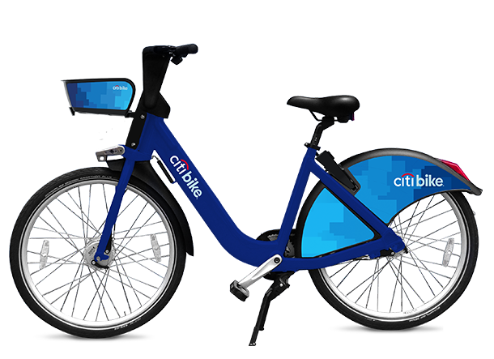
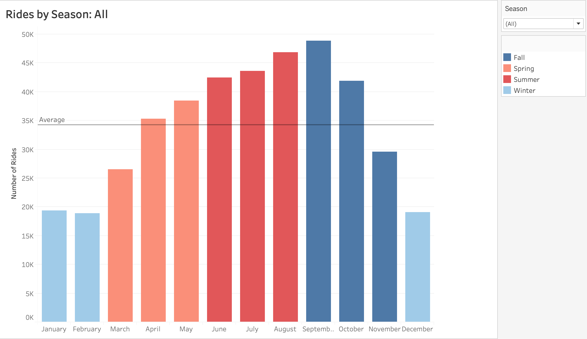
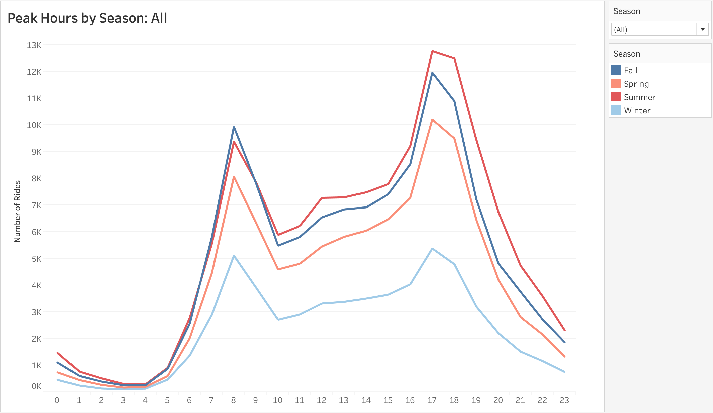
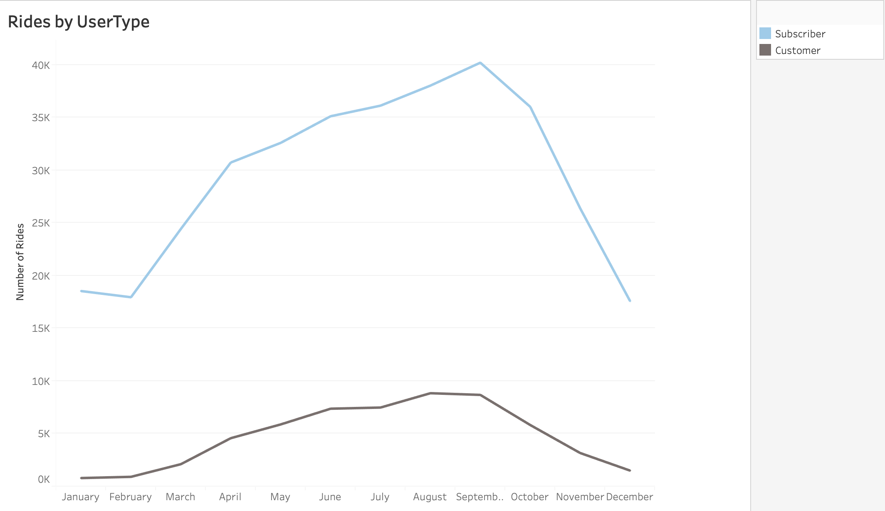
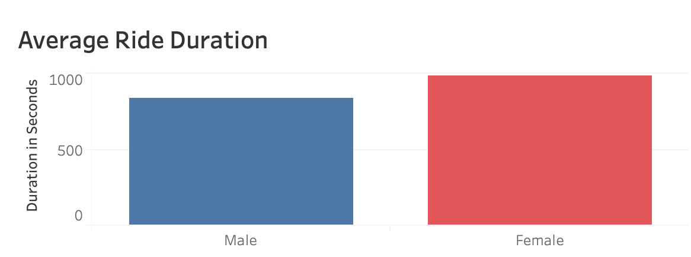
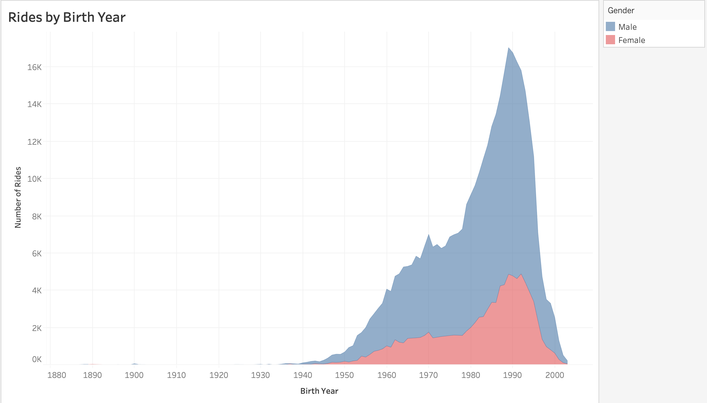
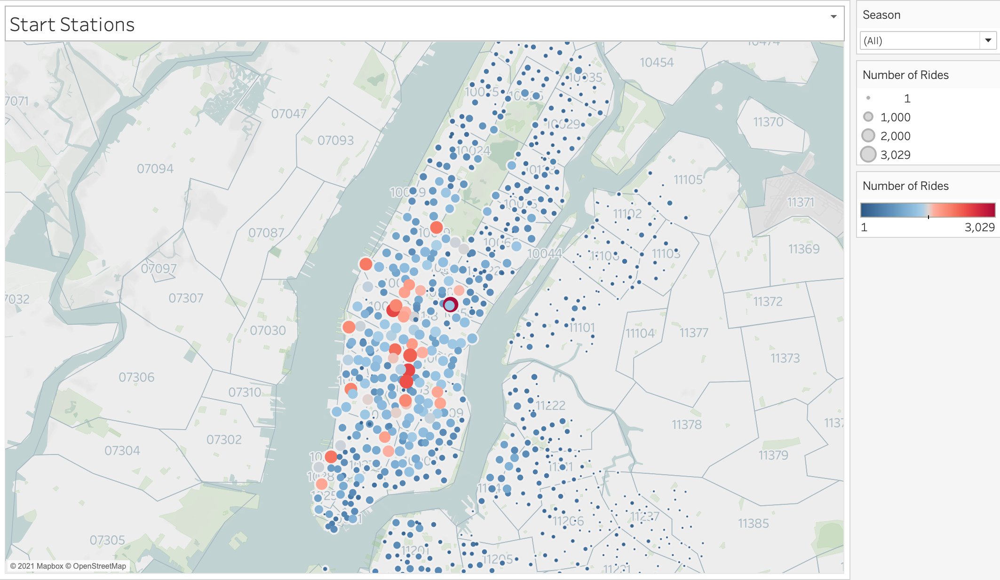
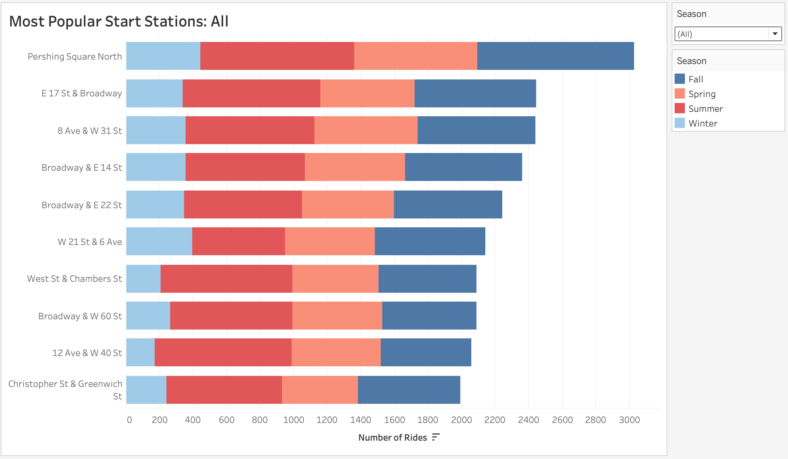
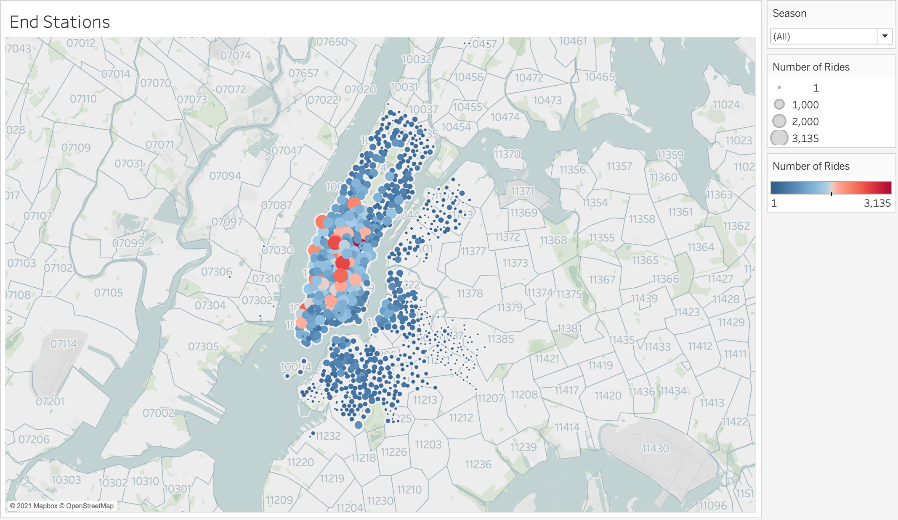
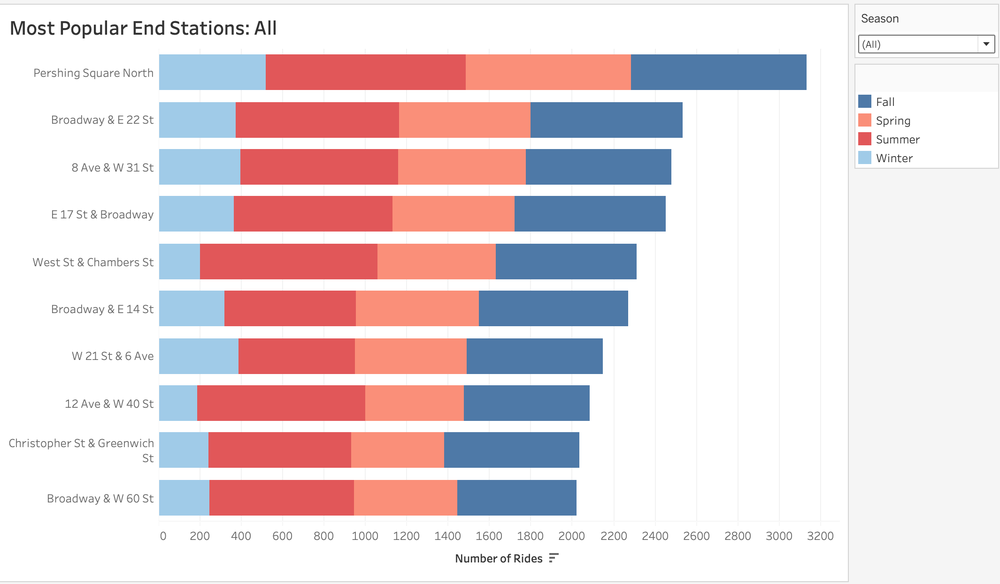

# Tableau - Citi Bike Analytics

## Background

Since 2013, the Citi Bike Program has implemented a robust infrastructure for collecting data on the program's utilization. Through the team's efforts, each month bike data is collected, organized, and made public on the [Citi Bike Data](https://www.citibikenyc.com/system-data) webpage.

However, while the data has been regularly updated, the team has yet to implement a dashboard or sophisticated reporting process. City officials have a number of questions on the program, so your task is to build a set of data reports to provide the answers.

## Objective
- Aggregate the data found in the Citi Bike Trip History Log
- Create a 4-10 Total "Phenomenon" visualizations to analyze the Citi Bike Program
- Create 2 dashboards 
- Create a dynamic map that shows how each station's popularity changes over time (by month and year)

## Research Questions
- How many trips were recorded over 2019?
- Does seasonality affect number of trips for that time period?
- What are peak riding hours?
- Do males or females ride more? Who rides for longer?
- What ages use the service the most? The least?

## Data
New York Citi Bike Program trip history data for 2019 was analyzed. 2019 data was analyzed over the 12-month period in order to determine trends. While Citi Bike history data for 2020 was available, the trends were vastly different due to COVID-19; therefore, 2019 data was analyzed as more reflective of a typical year.

### Data Exploration
Citi Bike trip history data was taken from the downloadable files made available by Citi Bike at https://s3.amazonaws.com/tripdata/index.html.  The data includes:
- Trip Duration (in seconds)
- State Time and Date
- Stop Time and Date
- Start Station Name
- End Station Name
- Station ID
- Station Latitude
- Station Longitude
- Bike ID
- User Type: Customer- user with either a 24-hour pass or 3-day pass, Subscriber- annual member
- Gender: 0 - Unknown, 1- Male, 2 - Female
- Year of Birth

### Data Cleaning
Data files corresponding to January-December 2019 were selected and cleaned for analysis. Due to Tableau’s restriction of a 10GB storage limit, a 2% selection of randomized data for each month was taken. This subset of data was compiled into a new CSV available to Tableau visualizations.

## Analysis
A Tableau story consisting of 2 Dashboards investigating the Rides Over the Year and Demographics Phenomena in addition to  maps detailing station start and end locations was created. 

### When are Citi Bike Riders riding?
Riders are overwhelmingly using this service out in the summer season, which is understandable as the weather influences the usability of this service. What was interesting is that September is the month that holds the most rides. This may be due to school starting back up or increased activity during the Labor Day holiday weekend. Further investigation would be interesting to understand this increased activity.

Peak hours show high spikes between 8am-9am and an even higher spike between 5pm-6pm.  This is most likely due to alignment with work schedules with most people getting to work between 8am and 9am and finishing work beginning at 5pm.

### Who are Citi Bike Riders?
Citi Bike Subscribers, those who purchase an annual subscriber, are the majority users versus Citi Bike Customers, those who purchase 24-hour or 3-day passes.

Males make up the overwhelming majority of Citi Bike users month over month.  What is interesting to note is that while makes make more trips, females actually ride longer on average than males. Females ride approximately 100 seconds, close to 2 minutes, longer than males.

Birth year and therefore age influence ridership.  A variety of ages use Citi Bike bikes yet there is a large peak for users born in 1989 both both male and female riders.  

### Where are Citi Bike Riders starting and ending their rides?
The Perishing Square North location is the most popular station to begin and end a ride at any time of year. This is most likely due to its proximity to Grand Central Station.  Due to its commuter traffic with individuals, Grand Central Station brings individuals to the city to work.  And it appears these individuals are using the Citi Bikes to travel from Grand Central Station to their place of work and back.  

## Conclusion
It is great to see that riders are finding value in the Citi Bike program. Ridership is increasing and there are many more subscribers who use the service annually and therefore take more trips than there are customers who purchase 24-hour or 3-day passes.

Gender does play a role in the rider base as males outnumber females when investigating who is riding. However, females do take longer trips. Age also influences Citi Bike riders as ridership peaks for those born in 1989.

Location is a prime indicator for the popularity of a station as points of interest spark use.  The top five Citi Bike stations are located near train and subway stations and along points of attraction such as Broadway.

## Recommendations
Continue to target the female demographic as there is a lot of room for growth to get to the usage levels of male counterparts.  

In addition, average duration of bike rides are completed in half or a third of the time that the bike is allotted for; therefore, maybe we could incentivize these shorter trips in order to allow for faster bike availability without needing to deploy additional bikes.

## Tableau Workbook:
https://public.tableau.com/profile/alex.arnold#!/vizhome/Bike_16148897345070/CitiBikeProgramAnalysis2019_1

### Copyright

Alex Arnold © 2021. All Rights Reserved.
